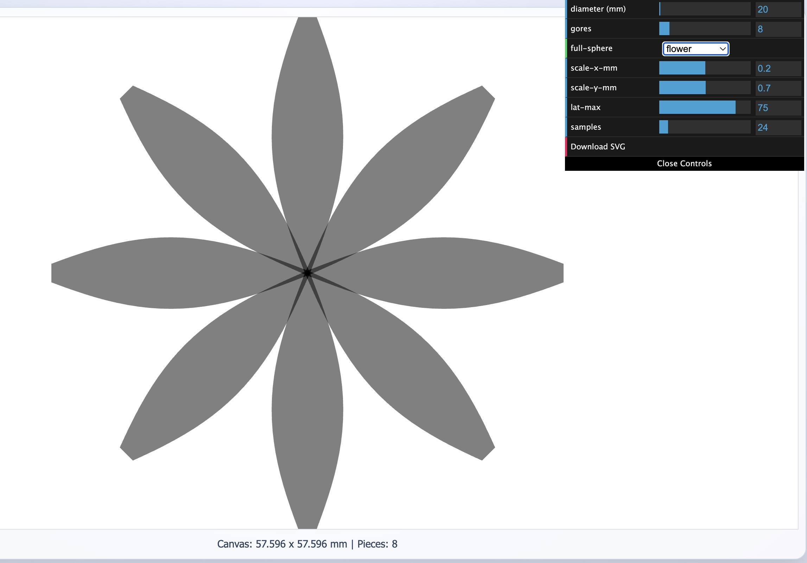
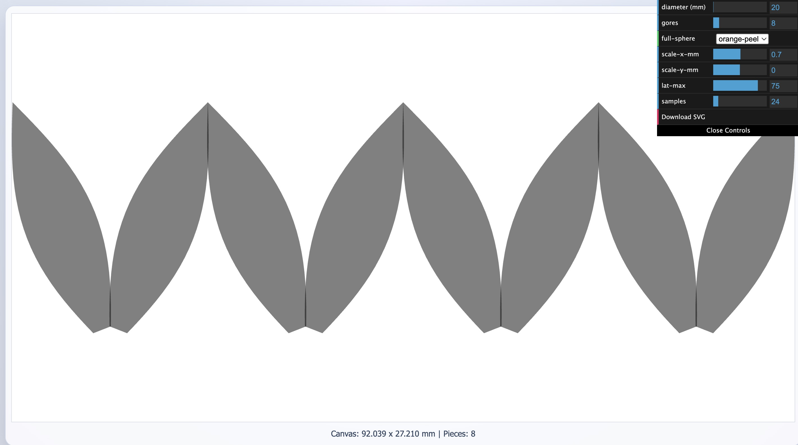
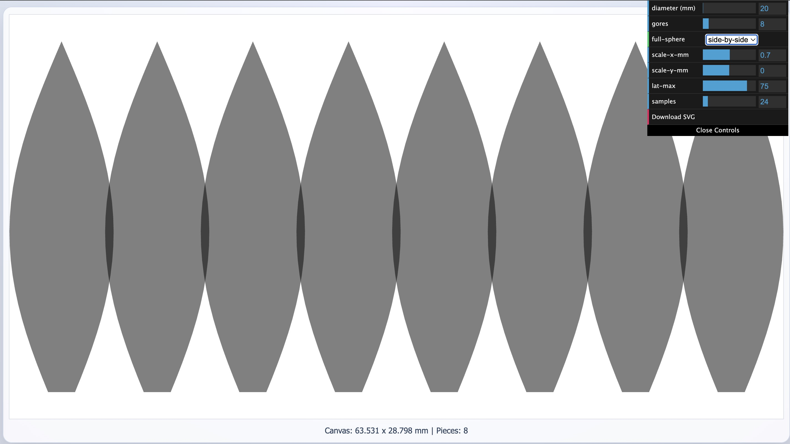

# Lune Gore SVG Generator (Web)

Play online: https://soswow.github.io/lune-gore-svg-generator/

This project is a browser-based TypeScript app that generates SVG globe gores (lunes).

## Layout examples

`flower`: gores are arranged radially like petals and touch at one shared tip point.



`orange-peel`: gores are chained with alternating tilt and alternating tip-touch points.



`side-by-side`: gores are laid out in a linear strip for straightforward cutting/alignment.



## Project structure

- `index.html`: root page (redirects to built app in `js/dist/index.html`)
- `js/index.html`: Parcel entry HTML
- `js/src/main.ts`: TypeScript source
- `js/dist/`: build output folder
- `js/package.json`: dependencies and scripts

## Development

```sh
cd js
npm install
npm run start
```

This uses Parcel dev server and opens the app in your browser.

## Build

```sh
cd js
npm run build
```

Configured scripts in `js/package.json`:

```json
{
  "clean:dist": "rm -rf dist/*",
  "prestart": "npm run clean:dist",
  "start": "parcel index.html --open",
  "prebuild": "npm run clean:dist",
  "build": "parcel build index.html --public-url https://soswow.github.io/lune-gore-svg-generator/js/dist"
}
```

## GUI controls

The `dat.gui` panel exposes the same generator options:

- `diameter`
- `gores`
- `full-sphere`: `single`, `side-by-side`, `flower`, `orange-peel`
- `scale-x-mm`
- `scale-y-mm`
- `lat-max` (`0..90`, with lower bound fixed at `-90`)
- `samples`

`Download SVG` exports the current result.

`flower` mode behavior: when `scale-y-mm` changes, petals are shifted radially so the reference outer circle remains the same size.
