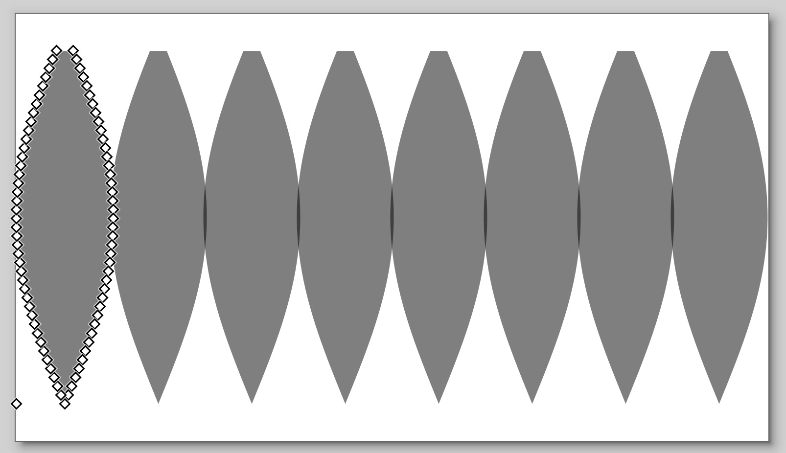
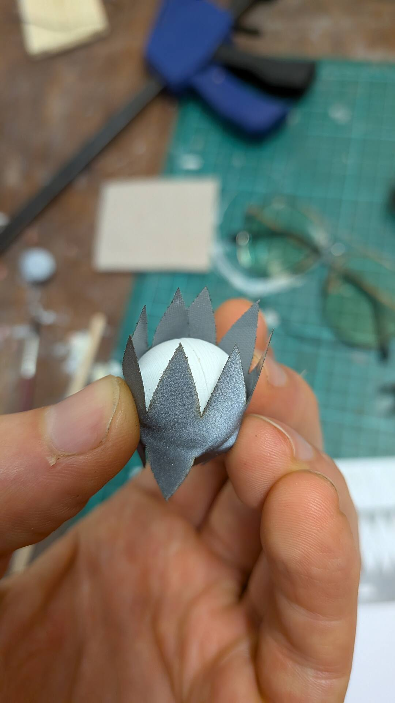
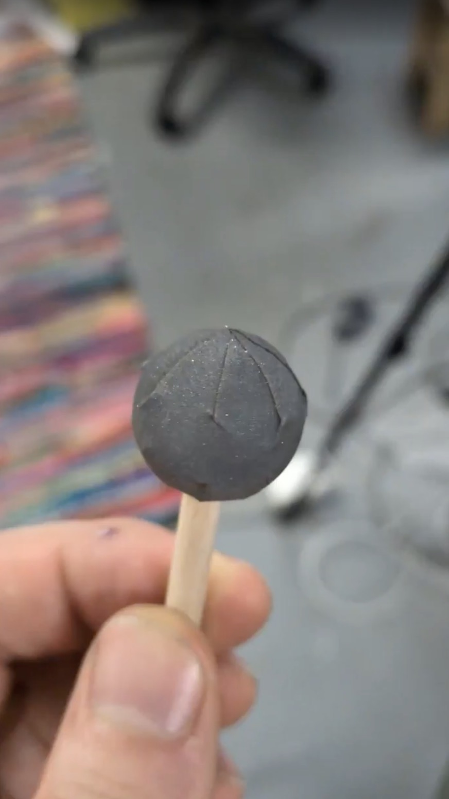
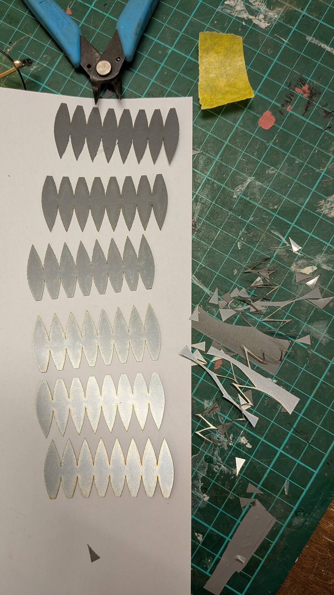

# Globe Lune (Gore) SVG Generator

This is a small Python utility that generates an SVG outline for a spherical **lune / globe gore**. A gore is a “peel” bounded by two meridians that you can repeat to cover a sphere.

The outline is based on a common globe-gore approximation: distances along the meridian are preserved, and the width at each latitude equals the spherical arc between meridians. This yields a sinusoidal edge (useful for paper or vinyl sphere coverings).

## Usage example

```sh
python3 lune_svg.py  --diameter 20.5 --gores 8 --samples 40 --count 8 --scale-x-mm 0.3 --lat-min -80
```

This command generates an SVG strip with **8 globe-gores** (`--count 8`) sized for a sphere of **20.5 mm diameter** (`--diameter 20.5`) split into **8 total gores around the ball** (`--gores 8`).
Each gore is sampled with 40 segments per edge (`--samples 40`), starts at latitude **-80 deg** (`--lat-min -80`), and gets progressively wider by **+0.3 mm per peel** (`--scale-x-mm 0.3`) to help with fit tuning.  
Because no `-o/--output` is provided, the script writes an auto-named file like `lune_diameter-20p5_gores-8_count-8_scale-x-mm-0p3_lat-min-m80_samples-40.svg`

Resulting SVG will look like this:



Then it can be applied on a ball:

<p align="center">
  
  
  
</p>


If `-o/--output` is omitted, the file name is auto-generated from non-default parameters.

### Useful options

- `--diameter`: sphere diameter in mm
- `--gores`: number of lunes to cover the sphere
- `--count`: number of peels laid out side by side
- `--scale-x-mm`: additive width change per peel in mm
- `--scale-y-mm`: additive height change per peel in mm
- `--lat-min` / `--lat-max`: latitude range in degrees (default: full sphere)
- `--samples`: number of line segments per edge (lower = fewer nodes)
- `-o` / `--output`: output filename (optional; auto-generated when omitted)

Note: output style is fixed to filled black at 50% opacity, with no stroke.

## Notes

- The sphere cannot be flattened without distortion; this is the standard globe-gore approximation used for paper globes and similar coverings.
